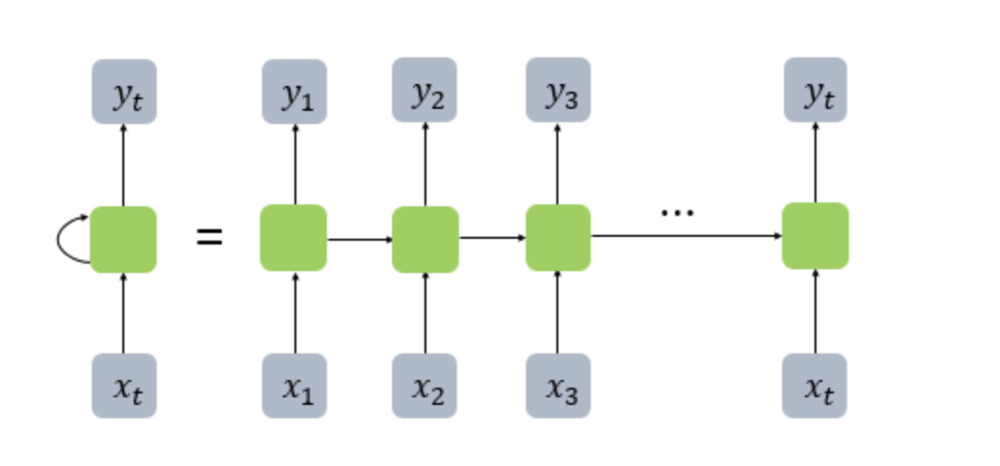
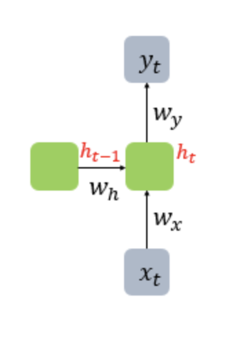

## RNN(순환 신경망, Recurrent Neural Network)
- 입력과 출력을 시퀀스 단위로 처리하는 모델
- 은닉층의 결과값 → 다음계산의 입력 및 출력층으로 보내는 형식으로 작동


- 은닉 상태(hidden state) : 다음 시점인 자신에게 보내는 값

- 종류
  - 일대다 : 이미지 캡셔닝
  - 다대일 : 감성 분류, 스팸메일 분류
  - 다대다 : 번역, 태깅작업(개체명 인식)

- 각 셀에서의 정의 값


  - 은닉층 : $h_{t} = tanh(W_{x}x_{t} + W_{h}h_{t-1} + b)$
  - 출력층 : $y_{t} = f(W_{y}h_{t} + b)$
- 활성화 함수 : tanh를 주로 사용
  - 출력층의 활성화 함수 : 푸는 문제에 따라 다름.
  - 이진 분류 - 로지스틱 회귀를 사용해 시그모이드 사용/ 다중 분류 - 소프트맥스 함수 사용

- NP 로 RNN 이해하기
```python 
import numpy as np

timesteps = 10 # 시점의 수. NLP에서는 보통 문장의 길이
input_dim = 4 # 입력의 차원. NLP에서는 보통 단어 벡터의 차원
hidden_size = 8 # 은닉 상태의 크기(메모리 셀의 용량)

inputs = np.random.random((timesteps, input_dim)) # 입력 2D Tensor

hidden_state_t = np.zeros((hidden_size,)) # 초기 은닉 상태

print(inputs.shape)
print(hidden_state_t)
```
- 출력값
```
(10, 4)
[0. 0. 0. 0. 0. 0. 0. 0.]
```

```python
Wx = np.random.random((hidden_size, input_dim)) # (8,4), 입력에 대한 가중치
Wh = np.random.random((hidden_size, hidden_size)) # (8,8), 은닉 상태 가중치
b = np.random.random((hidden_size,)) # (8,), 편향(bias)

print(np.shape(Wx))
print(np.shape(Wh))
print(np.shape(b))
for input_t in inputs:
  print(input_t.shape)
  print(input_t)
  break
```
- 출력값
```
(8, 4)
(8, 8)
(8,)
(4,)
[0.4589433  0.86324712 0.77717019 0.76957596]
```

```python
total_hidden_states = []

# (8,4)(4,) + (8,8)(8,) + (8,) = (8,)
# 셀 동작
for input_t in inputs:
  # tanh(Wx*X + Wh*H + b)
  output_t = np.tanh(np.dot(Wx, input_t) + np.dot(Wh, hidden_state_t) + b)
  total_hidden_states.append(list(output_t)) # 각 시점의 은닉상태 체크
  hidden_state_t = output_t # 은닉 상태 저장

total_hidden_states = np.stack(total_hidden_states, axis = 0) # 값 정리

print(total_hidden_states.shape)
print(total_hidden_states)
```
- 출력값
```
(8,)
[0.99996453 0.99997925 0.99999892 0.99999722 0.99995496 0.9999922
 0.99993341 0.99999865]
(8,)
[0.99997407 0.99997084 0.99999957 0.99999798 0.99996272 0.99999506
 0.99997275 0.99999876]
(8,)
[0.99996796 0.99995372 0.99999928 0.99999698 0.99995527 0.9999939
 0.99995922 0.99999801]
(8,)
[0.99996183 0.99998266 0.9999993  0.99999771 0.99992905 0.99999247
 0.9999443  0.99999808]
(8,)
[0.99991295 0.99985856 0.9999945  0.99998411 0.99979595 0.9999766
 0.99972246 0.99998286]
(8,)
[0.99991773 0.99988757 0.99999216 0.99998733 0.99990868 0.99998218
 0.99966446 0.99999193]
(8,)
[0.99996309 0.99993107 0.99999898 0.9999958  0.99994731 0.99999274
 0.99994696 0.99999707]
(8,)
[0.99991189 0.99997017 0.9999947  0.99999371 0.99989056 0.99998397
 0.99964804 0.99999476]
(8,)
[0.99994275 0.99997567 0.99999837 0.99999683 0.99992567 0.99999133
 0.99987851 0.999997  ]
(8,)
[0.99995622 0.99989429 0.9999977  0.99999069 0.9999202  0.99998594
 0.99990285 0.99999518]
(10, 8)
[[0.99996453 0.99997925 0.99999892 0.99999722 0.99995496 0.9999922
  0.99993341 0.99999865]
 [0.99997407 0.99997084 0.99999957 0.99999798 0.99996272 0.99999506
  0.99997275 0.99999876]
 [0.99996796 0.99995372 0.99999928 0.99999698 0.99995527 0.9999939
  0.99995922 0.99999801]
 [0.99996183 0.99998266 0.9999993  0.99999771 0.99992905 0.99999247
  0.9999443  0.99999808]
 [0.99991295 0.99985856 0.9999945  0.99998411 0.99979595 0.9999766
  0.99972246 0.99998286]
 [0.99991773 0.99988757 0.99999216 0.99998733 0.99990868 0.99998218
  0.99966446 0.99999193]
 [0.99996309 0.99993107 0.99999898 0.9999958  0.99994731 0.99999274
  0.99994696 0.99999707]
 [0.99991189 0.99997017 0.9999947  0.99999371 0.99989056 0.99998397
  0.99964804 0.99999476]
 [0.99994275 0.99997567 0.99999837 0.99999683 0.99992567 0.99999133
  0.99987851 0.999997  ]
 [0.99995622 0.99989429 0.9999977  0.99999069 0.9999202  0.99998594
  0.99990285 0.99999518]]
```
